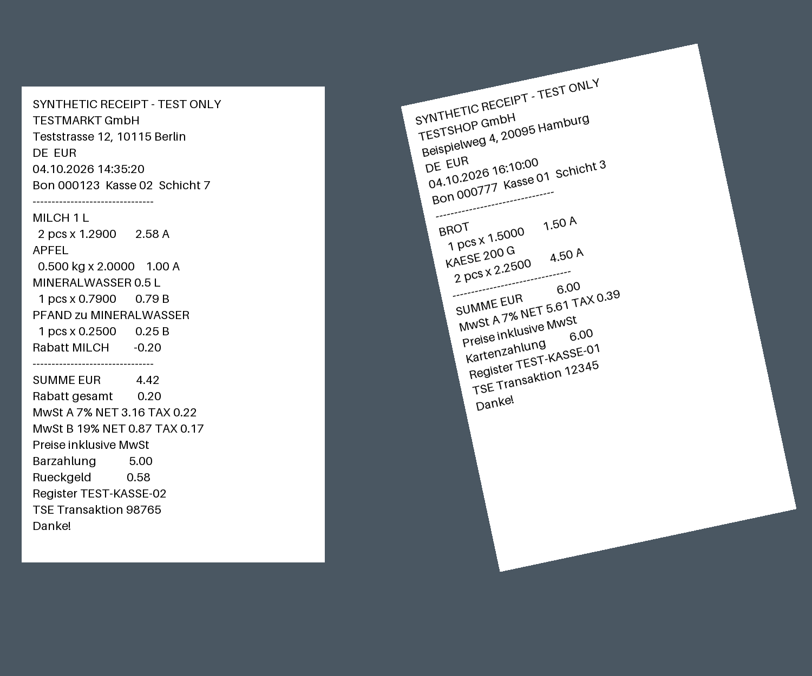
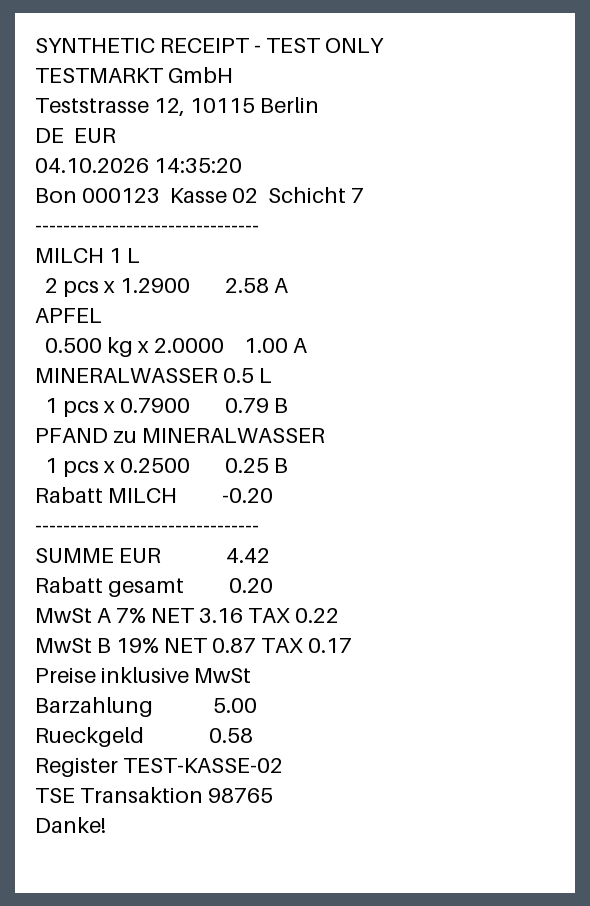
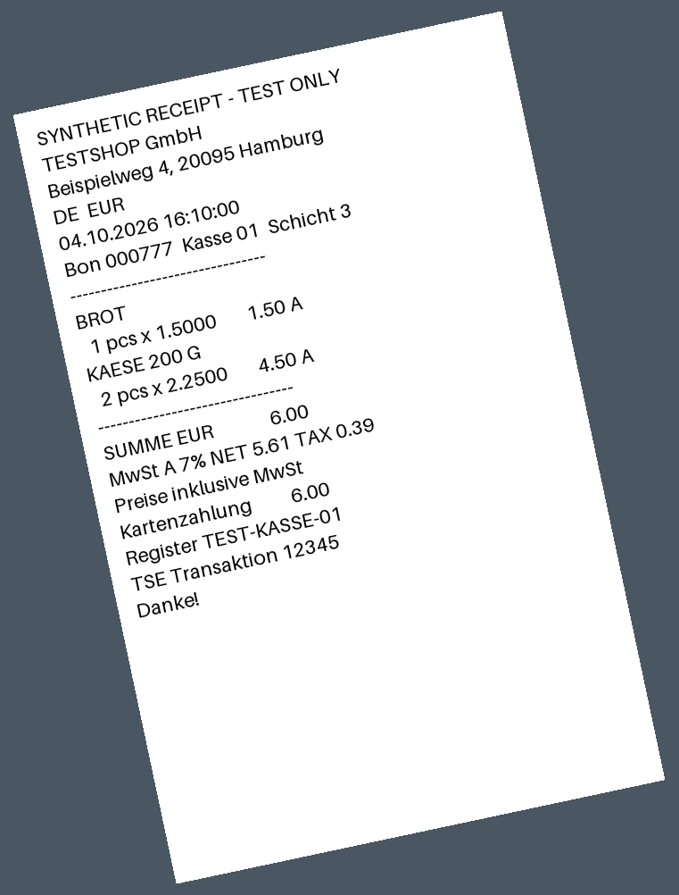

# Р3: повёрнутые чеки — данные и результат для ручной приёмки

Исправлен порядок углов: quad следует бумаге и её тексту (TL → TR → BR → BL по
часовой стрелке), независимо от осей кадра. Detect и crop используют общий
валидатор. Первая точка больше не обязана иметь минимальную сумму x+y. Валидатор
сохраняет циклическое начало и отвергает геометрически неверные фигуры. Поворот
сохраняется в ReceiptImage/detail API и передаётся в recognize prompt.
Плюс означает поворот текста по часовой стрелке, минус — против; 270° = −90°.
Публичные поля API, модели, миграции и frontend не менялись.

## Настоящий результат Codex, 2026-10-05

Изолированная QA DB `checkist_qa_r3_codex`, Windows native Codex CLI 0.160.0,
`gpt-6.1-sol`, существующий ChatGPT auth. Полный worker занял **134.585 с**, exit 0.
HTTP upload 202 → job succeeded → 2 вырезки/2 импортированных чека, review=0.
Получены 6 строк/5 товаров. Время attempts: detect 13.270 с, recognize 63.022 и
56.707 с. Totals 4.42 / 6.00 EUR; шесть имён, quantities, units, unit prices и
amounts совпали с синтетическим эталоном.

| Чек | Вырезка | Угол в detail API | Итог | Строк |
| --- | --- | --- | --- | --- |
| TESTMARKT | 590×906 | 0° | 4.42 EUR | 4, включая PFAND |
| TESTSHOP | 761×1002 | −12° | 6.00 EUR | 2 |

Ниже синтетический вход и **фактические PNG вырезок**, полученные через MEDIA HTTP
после реального worker. Это данные серверной проверки; скриншотов браузерного UI нет.

Вырезки получены по bbox с отступом 1% размеров исходного фото и сохраняют наклон.
Deskew и перспективного преобразования нет. На этом входе bbox не ухудшил
распознавание строк; качество сложных/реальных фото и больших углов не измерено.

## Проверено и прошло

- Полный backend: 268 без БД / 892 integration, exit 0. PostgreSQL test DB
  `test_checkist_qa_r3`, QA Redis, временный MEDIA, fake/mock вместо настоящего Codex.
- Валидатор: −12°, +30°, 90°, 180°, 270°; полный оборот через 3°, три пропорции
  кадра, четыре начала обхода; отрицательные случаи и охват quad bbox.
- Fake `rotated_receipt` и `rotated_two_receipts`: настоящий Django APIClient с CSRF,
  host worker, crop с точными пикселями, persisted quad/rotation, detail/list API,
  импорт и replay. Эти два сценария включены в полный backend-набор.
- `node frontend/scripts/check_recognition_proxy.mjs dev http://127.0.0.1:15173`:
  exit 0, 62 HTTP-запроса через Vite dev; обычные fake success/cancel/retry/review.
- Настоящий Codex smoke выше — отдельный запуск, автотесты его не вызывают.

Полные команды, ошибки до исправления и результаты:
[docs/verification.md, раздел Р3](../../../docs/verification.md#р3-повёрнутые-quad).

## Проверено и не прошло

До исправления все пять заданных углов отвергались дополнительной проверкой
начала quad в images.py; падающие тесты воспроизведены, затем прошли в полном
наборе. Два промежуточных сбоя тестов и ошибка подготовки QA исправлены и
перечислены в verification.md. Нерешённых отказов окончательных проверок нет.

## Не проверено и почему; запуск для человека

Визуальную/интерактивную приёмку React и админки выполняет человек. Автоматический
обход UI запрещён проектом. Реальное OCR других углов/фото и preview proxy не проверены.

1. Применить **полный QA environment** из docs/verification.md. Использовать свободный
   QA project/DB, отдельные MEDIA и scratch; DEBUG=1, ALLOW_LOCAL_RECOGNITION_API=1,
   доверенный Origin http://127.0.0.1:15173. Нужен только loopback, сессия пользователя
   для локального API не требуется; CSRF SPA получает сама. Записи только в QA.
2. Запустить QA Compose, применить migrate; создать изображения командой
   `./backend/.venv/Scripts/python.exe -X utf8 backend/manage.py seed_recognition_demo --rotated`.
   Здесь также приложен [single_rotated.png](single_rotated.png) для одного чека.
3. API: `./backend/.venv/Scripts/python.exe -X utf8 backend/manage.py runserver 127.0.0.1:18000 --noreload`.
   С тем же DB/MEDIA env, RECEIPT_OCR_PROVIDER=fake:
   `./backend/.venv/Scripts/python.exe -X utf8 backend/manage.py recognition_worker --fake-scenario rotated_two_receipts`.
4. В frontend: `npm.cmd ci`, `npm.cmd run dev -- --port 15173`, proxy target API 18000.
   Открыть SPA, загрузить double_rotated.png, дождаться succeeded. Проверить
   2 вырезки, полные края бумаги/текст, два чека с totals 4.42/6.00, 6 строк с PFAND.
   Повторить тот же файл — job/чеки не дублируются.
5. Для single_rotated.png остановить свой worker, запустить его с
   `--fake-scenario rotated_receipt`: succeeded, 4 строки, 4.42 EUR. В общей DB чек
   может переиспользоваться. В detail `/api/recognition/receipt-images/<id>/` quad
   должен сохраняться, угол −12°; список содержит только bbox.
6. Для реального smoke нужна пустая QA DB либо другое исходное фото: заменить
   provider на codex_cli, указать native codex.exe, оставить существующий auth,
   убрать fake-scenario. Загрузить double_rotated.png и запустить worker --once.
   Сверить actual job, PNG, строки/суммы; результат модели может варьироваться.
7. Админка при необходимости — напрямую http://127.0.0.1:18000/admin/ с is_staff;
   ручной сценарий в docs/verification.md. Recognition-модели там не зарегистрированы.
   После проверки остановить свои процессы и выполнить compose down своего QA project,
   без -v. Перед сдачей процессы этой проверки остановлены, QA-тома сохранены.

Fake не читает произвольные фото. Приложенные входы с вымышленными данными
созданы существующим Pillow-генератором; реальных чеков и секретов здесь нет.
