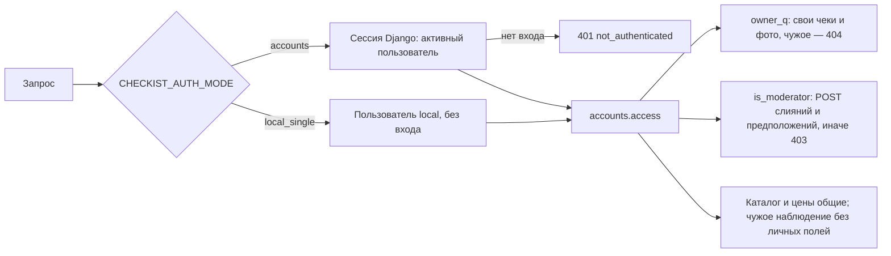
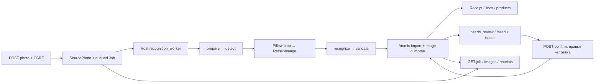
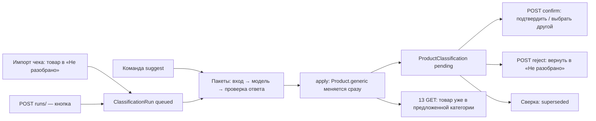

# Архитектура Checkist

## Реализовано

Система состоит из локальных React/TypeScript/Vite SPA и Django/DRF API, предметной модели чеков, приложения `recognition` и трёх Compose services: Postgres, Redis и Celery worker. Распознавание выполняет отдельная host-команда `recognition_worker` рядом с Codex CLI. Docker Desktop использует Linux daemon. Браузер обращается к Vite на своём origin, proxy передаёт `/api` в Django без rewrite. Django и OCR-воркер обращаются к опубликованному Postgres, Celery — к service DNS внутри Compose-сети. Данные разделены по пользователям: у чека и фото есть владелец, доступ определяет режим `CHECKIST_AUTH_MODE` — [пользователи и доступ](#пользователи-и-доступ). Таблица ниже — локальные dev и QA; серверная схема (gunicorn за Caddy, службы systemd, без Docker) — в [deployment.md](deployment.md).

| Процесс | Dev на хосте | QA на хосте | В Docker-сети |
| --- | --- | --- | --- |
| Django/DRF | `127.0.0.1:8000` | `127.0.0.1:18000` | API-контейнер в основной архитектуре отсутствует |
| Postgres | `127.0.0.1:15432` | `127.0.0.1:25432` | `postgres:5432` |
| Redis | `127.0.0.1:6379` | `127.0.0.1:16379` | `redis:6379` |
| Celery worker | Нет published ports | Нет published ports | `checkist@worker`, broker через `redis:6379/0` |
| `recognition_worker` | Host-процесс, без HTTP-порта | Host-процесс, тот же QA DB/MEDIA, что у API | В Compose не запускается |
| SPA / Vite dev и preview | `127.0.0.1:5173` | `127.0.0.1:15173` | Контейнера нет |

`localhost` внутри worker означает сам контейнер. Compose переопределяет `POSTGRES_HOST=postgres`, `POSTGRES_PORT=5432` и три Redis URL; изменение host-портов не меняет внутренние порты. Порт 15432 выбран, потому что 5432 в проверенной Windows-среде занят локальным Postgres.

## Потоки и состояние

- SPA запрашивает `<VITE_API_BASE_URL>/health/` (default `/api/health/`), `Accept: application/json`, `credentials: omit`, `cache: no-store`. Адаптер валидирует JSON и соответствие HTTP/тела, сохраняет все checks при 503, ограничивает fetch и чтение тела 15 секундами. Страница показывает загрузку, успех, частичный отказ, безопасные ошибки и повтор; предыдущие запросы отменяются. Это технический health UI, без данных чеков: API чтения клиент пока не вызывает.
- `GET /api/health/` запускает три probes параллельно в `ThreadPoolExecutor(max_workers=3)`: SQL `SELECT 1`, Redis cache set/get/delete, Celery inspect ping. Соединения БД каждого probe-потока закрываются. Известный отказ зависимости даёт HTTP 503 с независимыми `checks`.
- `check_services` последовательно проверяет SQL/cache и публикует `health.ping` через реальный broker, затем читает результат. Control ping и выполнение задачи — разные проверки.
- Django global DRF permission — `IsAuthenticated`; каждая вью API задаёт свои классы из `accounts.access`, health явно открыт (`AllowAny`, `authentication_classes = []`). Кто пользователь запроса и можно ли ему — [пользователи и доступ](#пользователи-и-доступ).
- `/admin/` — стандартный Django admin (`backend/config/urls.py`), HTML-интерфейс для пользователей с `is_staff`. Его открывают напрямую на Django (`127.0.0.1:8000`, QA — `18000`): Vite проксирует только `/api`, а `/admin` и `/static` — нет. Сессии хранятся в Postgres, cookie `sessionid` общая с API: вход в админку в режиме `accounts` — это и вход в приложение. Статику админки отдаёт `runserver` при `DJANGO_DEBUG=1`; на сервере её собирает `collectstatic` в `DJANGO_STATIC_ROOT` и раздаёт обратный прокси, secure-cookie и HSTS включаются настройками окружения ([deployment.md](deployment.md)).
- Приложения `stores`, `catalog`, `receipts` не имеют своих URL, задач и команд: это модели, функции, вызываемые из кода, и `admin.py` с настройками админки. `receipts` зависит от `stores` и `catalog`, те друг от друга не зависят; `health` с ними не связан.
- Приложение `api` — HTTP-слой: прежние 13 GET каталога/цен, recognition/receipts, слияния, предположения, статистика и маршруты входа (`/api/auth/*`, `/api/me/`). Собственных моделей/миграций нет; новые POST вызывают сервисы записи recognition, провайдера из HTTP не запускают. Оно зависит от catalog/stores/receipts/recognition/accounts и config.exceptions; приложения моделей остаются независимыми от HTTP. `config/urls.py` подключает `api/health/` первым, затем `api/` → `api.urls` и `^media/` → `accounts.media.serve`; последний маршрут `api.urls` — запасной JSON `404 not_found` для неизвестных путей с завершающим `/`.
- Запрос API чтения: `api.params.Params` разбирает query и копит ошибки в один `400`; views (`api/views/catalog.py`, `prices.py`, `compare.py`) строят выборки через `receipts.prices` (`price_history`, `price_groups`, `last_prices`, `price_summary`); `api.common` сериализует деньги строками из `Decimal` и строит дерево категорий в памяти одним запросом; `api.pagination.paginate` формирует страницу; `api.rates` разбирает курсы из запроса. Ошибки всех DRF views приводит к единому формату `config.exceptions.exception_handler`. Курсы валют сервер не хранит: пересчёт возможен только по курсам из запроса.
- Ошибки запроса до `Params` и DRF защищены общим слоем `config.requests`: WSGI/ASGI request classes безопасно разбирают Content-Type в конструкторе; `ApiCommonMiddleware` заменяет стандартный CommonMiddleware, проверяет Host, percent-кодирование и UTF-8 query, разбор Accept и запись без слэша. Кодировка query не зависит от charset body. Семейство `SuspiciousOperation`, `BadRequest`, ошибки чтения/разбора тела дают JSON `400 invalid_request` без текста исключения; штатный лимит query — 1000 полей. Неизвестные ошибки реализации остаются `500 internal_error`. Access log `django.server` скрывает request target API. Путь вне `/api/` сохраняет стандартное поведение Django; отказы HTTP-сервера до Django (414/431) не покрыты JSON-handler. Read-only views/health не читают body; новый API загрузки использует bounded multipart parser, cancel/retry — bounded UTF-8 JSON `{}` и явную CSRF-проверку до тела.
- `receipts.decimal_math` задаёт локальный Decimal-контекст для арифметики и округления цен на полном диапазоне моделей и курсов; его используют агрегаты и HTTP-слой. Нормализация в БД остаётся `numeric`. Многозапросное чтение не получает общего снимка: исчезнувшие между запросами группы пропускаются, без дополнительных SQL-запросов; гарантии — в [контракте](api-contract.md#общие-правила).

| Redis logical DB | Назначение | Локальная переменная |
| --- | --- | --- |
| 0 | Очередь/control Celery | `CELERY_BROKER_URL` |
| 1 | Результаты задач, TTL 60 секунд | `CELERY_RESULT_BACKEND` |
| 2 | Django RedisCache, prefix `checkist` | `DJANGO_CACHE_URL` |

Эти DB не являются границей безопасности. Redis без пароля — локальная dev/QA-конфигурация; публикация ограничена `127.0.0.1`. Health cache keys уникальны, TTL 5 секунд, удаление выполняется в `finally`. `health.ping` идемпотентна и не меняет бизнес-данные. При таймауте ожидания уже принятая task может выполниться позже.

Postgres содержит технические таблицы стандартных миграций `admin`, `auth`, `contenttypes`, `sessions`, 14 таблиц предметной модели, 4 таблицы `recognition`, таблицы `merges` и `classification` и счётчик входов `accounts_loginfailure`. Собственных моделей/миграций `health` и `api` нет. Учётные записи — штатный `auth.User`: пользователя `local` создают миграции владельца, остальных человек заводит сам (`createsuperuser`, админка). `seed_recognition_demo` создаёт два синтетических изображения только в QA/test MEDIA, без пользователей, заданий и предметных записей.

## Предметная модель

| Приложение | Таблицы | Код помимо моделей |
| --- | --- | --- |
| `stores` | `Country`, `Currency`, `TaxRate`, `Merchant`, `Store` | `normalize.py` — ключ адреса; сид-миграция `0002_seed_reference`; `admin.py` — 5 админок, форма магазина |
| `catalog` | `Category`, `GenericProduct`, `Brand`, `Product` | `units.py` — единицы и приведение к базовой; `admin.py` — 4 админки, защита от цикла категорий |
| `receipts` | `Receipt`, `ReceiptLine`, `ReceiptDiscount`, `ReceiptTax`, `ProductAlias` | `ownership.py` — пользователь `local`; `dedup.py` — фискальный ключ, поиск дубликатов в пределах владельца и сопоставлений; `validation.py` — проверка чека; `prices.py` — история цен и её агрегаты по группам «товар, страна, валюта»; `admin.py` — чек с тремя inline, строки чеков, сопоставления |
| `api` | Нет | `views/` — эндпоинты чтения; `params.py`, `pagination.py`, `common.py`, `rates.py` — разбор query, страницы, сериализация, курсы из запроса |
| `classification` | `ProductClassification`, `CreatedGenericProduct`, `CreatedCategory`, `ClassificationRejection`, `ClassificationRun`, `ClassificationAttempt` | `taxonomy.py` — ключ и проверка названий; `context.py` — вход модели; `validation.py` и `schemas/` — проверка ответа; `classifier.py` — протокол и явный fake; `runner.py` — исполнение пакета; `services.py` — применение, подтверждение, выбор другого, отклонение, сверка, запуски под `IMPORT_LOCK`; `admin.py` — только чтение; команды `product_classifications`, `seed_product_classification_demo`. HTTP — `/api/product-classifications/` в `api` |
| `merges` | `ProductMerge`, `ProductMergeMember`, `ProductMergeLine`, `ProductMergeAlias`, `ProductMergeRejection` | `detection.py` — поиск похожих названий одного продавца; `services.py` — предварительное слияние, подтверждение, отмена, исключение под `IMPORT_LOCK`; `visibility.py` — скрытие поглощённых товаров в 13 GET; `admin.py` — только чтение; команды `product_merges`, `seed_product_merge_demo`. HTTP — `/api/product-merges/` в `api`; клиент — `frontend/src/api/product-merges*.ts` и `features/merges` ([frontend.md](frontend.md)) |
| `recognition` | `SourcePhoto`, `ProcessingJob`, `ReceiptImage`, `RecognitionAttempt` | `queue`, `storage`, `images`, DTO/схемы, providers/supervisor, `resolution`/`importer`, `pipeline`, host-команды; `ownership.py` и команда `ownership check-rollback` — проверка перед откатом миграций владельца |
| `accounts` | `LoginFailure` | `access.py` — режим, пользователь запроса, фильтр владельца, классы доступа; `backends.py` и `throttle.py` — проверка пароля со счётчиком неудач; `media.py` — раздача MEDIA владельцу; `demo.py` и команда `seed_accounts_demo` — QA-демо двух учётных записей |

Магазин определяется продавцом и нормализованным адресом. Чек защищён от повторного ввода тремя уровнями unique-ограничений в пределах владельца: один кассовый чек у двух пользователей — две личные покупки. Каталог двухуровневый: обобщённый продукт для сравнения и конкретный товар. История цен отдельной таблицы не имеет и выводится из строк чеков. Сид-миграция создаёт три страны, три валюты и четыре ставки налога; чеки, магазины и товары не сидируются.

Поля, ограничения и откат — в [data-model.md](data-model.md). Существующие 13 GET каталога/цен сохраняют контракт и исключают несопоставленные позиции. API распознавания загружает фото, управляет заданиями и читает чеки со всеми строками — только свои; произвольного API редактирования нет. В админке у чека появились поле и фильтр владельца, `LoginFailure` доступна только для чтения, `recognition` в ней не зарегистрирован.

Compose создаёт сеть и тома отдельно по имени project: `checkist_dev` и `checkist_qa`. `postgres_data` хранит `/var/lib/postgresql/data`, `redis_data` — `/data` с AOF и `noeviction`. Worker собран из `backend/Dockerfile`, работает non-root (UID 10001), монтирует `backend/` в `/app:ro`, использует prefork/concurrency 2. Backend/frontend контейнеров, beat и Flower нет.

Postgres/Redis healthchecks запускаются каждые 5 секунд; worker — каждые 10 секунд. `depends_on: service_healthy` управляет стартом worker; healthy не гарантирует связи Windows с опубликованными портами и не заменяет SQL/cache/task проверки. При дальнейшей потере связи нужен отдельный сценарий отказа и восстановления.

## Конфигурация клиента

Vite dev/preview используют `/api` → `DEV_API_PROXY_TARGET` с сохранением пути, loopback host и `strictPort: true`. `envDir` указывает на корень, environment процесса выше файла. `envPrefix: []` отключает автоматическую публикацию env; `define` передаёт только `VITE_API_BASE_URL`. Секреты backend и Node-only proxy target не передаются браузеру. Публичный префикс фиксируется при сборке. Vite проксирует также `/media`. Произвольный внешний API origin/CORS не настроен; на сервере Vite не запускается — собранный SPA раздаёт Caddy ([deployment.md](deployment.md)). Клиент в режиме `accounts` показывает вход на том же адресе и отправляет cookie сессии со всеми запросами, кроме health. Подробности — [frontend.md](frontend.md#вход-сессия-и-разделение-пользователей-к1).

## Пользователи и доступ

Решение — [multi-user.md](multi-user.md), контракт — [api-contract.md](api-contract.md#реализовано-пользователи-вход-и-доступ-по-владельцу). Разработчиками не запускалось.

- **Одна точка правил.** `backend/accounts/access.py`: `mode()`, `request_user(request)`, `owner_q(request, prefix)`, `is_moderator(request)` и классы `SessionUserAuthentication`, `SignedIn` (13 GET), `LocalOrSignedIn` (чеки, распознавание, статистика, чтение слияний и предположений), `Moderator` (их POST). Вью не читают ни `request.user`, ни настройку режима.
- **`accounts`** — режим по умолчанию и единственный на сервере: пользователь берётся из сессии, `DEBUG`, `ALLOW_LOCAL_RECOGNITION_API` и адрес запроса не учитываются. Без настройки действует он: забытая переменная закрывает данные, а не открывает.
- **`local_single`** — разработка и локальные проверки: входа нет, каждый запрос принадлежит пользователю `local`, прежние правила (13 GET открыты; остальное — DEBUG + флаг + loopback). При `DJANGO_DEBUG=0` настройки с ним не загружаются: за обратным прокси каждый запрос приходит с loopback, и такой сервер отдал бы всё всем.
- **Вход.** Учётные записи `django.contrib.auth`, логин и пароль, сессионная cookie (`HttpOnly`, `SameSite=Lax`, на сервере `Secure`), CSRF. Маршруты — `/api/auth/csrf/`, `login/`, `logout/`, `password/`, `/api/me/`. Регистрации нет: пользователей заводит администратор. Проверка пароля для API и `/admin/login/` одна — `ThrottledModelBackend` со счётчиком неудач в PostgreSQL (`accounts.LoginFailure`); адрес клиента даёт `config.proxy.client_address` (за прокси — при `DJANGO_TRUST_PROXY=1`).
- **Личное и общее.** Владелец есть только у `Receipt` и `SourcePhoto`; строки, скидки, налоги, задания, вырезки и попытки наследуют его по связям. Магазины, каталог, написания, слияния и предположения общие. Общий каталог меняет только модератор (право `catalog.moderate_catalog`); журналы хранят, кто решил.
- **Цены.** Наблюдение цены — строка чека; отдельной таблицы нет. Проекция делается при чтении (`api/projection.py`): у чужой точки истории цен скрыты момент, количество, скидка, id чека и позиция. Агрегаты и сравнения считаются по всем пользователям.
- **Сервер.** `config.robots.NoIndexMiddleware` ставит `X-Robots-Tag` на каждый ответ и отдаёт `/robots.txt`; secure-cookie, HSTS, перенаправление на https и доверие заголовкам прокси включаются переменными окружения; резервные копии — `manage.py backup`. Порядок — [deployment.md](deployment.md), приёмка — [deployment-acceptance.md](deployment-acceptance.md).

## Распознавание: облегчённая v1

Очередь находится в PostgreSQL. Сессионная advisory-блокировка разрешает один host-worker; `SKIP LOCKED` выбирает готовый job. Lease 30 с, отдельный heartbeat каждые 5 с, `run_token` и `version` защищают записи от старого владельца. Recovery выполняет сам воркер перед claim, сохраняет результаты завершённых вырезок, обнаружение и успешный OCR; явный HTTP retry создаёт новый job и повторяет detect. Без воркера recovery не происходит. Ту же блокировку (`recognition.queue.WORKER_LOCK`) API читает из `pg_locks` своей БД, сам её не берёт: `executor.state` — `busy` при действующем executing lease, `idle` при удерживаемой блокировке без такого lease, иначе `absent`; `executor.available` = `state != "absent"`. Heartbeat простаивающего воркера не хранится, модели слота нет.

Исходные байты остаются неизменными в MEDIA. EXIF-ориентация применяется к отдельному RGB PNG preview, метаданные убираются; bbox вырезается с padding 1%, quad сохраняется, перспективное выравнивание не выполняется. Допускаются JPEG/PNG/WebP, один кадр, до 20 MiB/40 MP/10 чеков. Пути UUID, staging вне MEDIA, атомарное переименование; API выдаёт относительные `/media/` URL. MEDIA раздаёт вью `accounts.media.serve`: в `accounts` — только владельцу фото, в `local_single` — любой файл при DEBUG, без проверки флага API. Vite dev/preview проксирует `/api` и `/media`.

Геометрия detect/crop требует bbox в диапазоне 0..1 с положительной площадью и охватом всех углов quad, строго выпуклого обхода quad по часовой стрелке и угла текста −180..180; порядок углов относительно текста и циклическое начало сохраняются при любом повороте. Между разными чеками разрешены касание и пересечение осевых bbox до 10% площади меньшей рамки включительно (`MAX_RECEIPT_BBOX_OVERLAP_FRACTION` в `recognition/pipeline.py`, без env-настройки). Небольшое пересечение учитывает свободное поле bbox вокруг наклонной бумаги: у шести рамок из прогона 05.10.2026 максимум около 4,4%. Пересечение выше порога, дубликаты и вложенные рамки дают `geometry_requires_review` до создания вырезок; приватный detect сохраняется для разбора. Доля от меньшей рамки выявляет вложение независимо от размера внешней; допуск не гарантирует отсутствие чужого текста в padding вырезки. Форматы сохранённых данных и API не меняются; откат — revert кода, уже созданные вырезки и чеки сохраняются, автоматической переработки старых failed jobs нет (нужен явный retry).

Provider выполняет только извлечение, без ORM. `FakeProvider` — фиксированные синтетические DTO/управляемая отмена; `CodexCLIProvider` — detect v1 и observation v2, отдельные приватные scratch-каталоги, JSON Schema, проверка JSONL completion и результата. CLI работает без shell/web/multi-agent tools, с `shell=False`, read-only и `--ephemeral`; авторизация существующего host-пользователя. Windows Job Object останавливает своё дерево, POSIX — process group (watchdog исключён). Неудача Codex не включает fake. Структурированный ответ сам по себе не доказывает правильность распознавания. [OpenAI Docs](https://learn.chatgpt.com/docs/non-interactive-mode).

Import сериализован отдельной transaction advisory-блокировкой и fenced job row. Точные store/product/alias/GTIN совпадения переиспользуются, новые магазины и товары создаются автоматически; неподтверждённая идентичность оставляет issues. Владелец чека — владелец фото: воркер берёт его из задания, существующий чек ищется только среди чеков этого пользователя. Повторное фото связывается по сильному ключу либо точному store/time/total и дополняет только пустые поля и непривязанные товары при совместимой структуре строк. Суммы и существующие значения не перезаписываются. Неполный/противоречивый результат сохраняется на вырезке, domain-записи откатываются; часть needs_review может иметь Receipt, например при несопоставленном товаре.

Неполный результат исправляет и подтверждает человек: `POST /api/recognition/receipt-images/{id}/confirm/` принимает исправленные данные вырезки `needs_review` и в одной транзакции проводит их через тот же доменный импорт (`recognition/review.py` поверх `importer._import_domain`), под тем же мьютексом и блокировками задания и вырезки, что у воркера. Черновика на сервере нет, провайдер не вызывается, закрытые реквизиты берутся из сохранённого результата распознавания. Успех меняет вырезку на imported/reused/updated и пересчитывает завершённое задание (partial_succeeded → succeeded, когда успешны все вырезки); отказ ничего не сохраняет. Подтверждение допустимо только после завершения задания. Контракт — [api-contract.md](api-contract.md#подтверждение-вырезки-needs_review-человеком), хранение — [data-model.md](data-model.md#подтверждение-вырезки-человеком).

Cancel queued сразу даёт cancelled, running — cancel_requested до остановки провайдера. Перед импортом проверяется durable cancel; последний import и terminal status фиксируются одним commit. Уже сохранённые чеки остаются. Ошибка одного crop не теряет другие; terminal statuses: succeeded, partial_succeeded (включая только review), failed, cancelled. Повтор провайдера — максимум одна дополнительная попытка для transient ошибок; budget 2400 с от первого claim, detect 90 с, recognize 180 с/crop.

Доступ: в `local_single` — DEBUG + `ALLOW_LOCAL_RECOGNITION_API=1` + loopback peer, в `accounts` — вход и только свои объекты; unsafe методы требуют CSRF в обоих режимах. Очередь и воркер одни на всех пользователей: задания идут по порядку, один вход Codex. Health/Celery не проверяют OCR-воркер, Codex или его auth. Запуск — [development.md](development.md#распознавание-запуск-для-клиента), проверки — [verification.md](verification.md#распознавание-сквозная-серверная-проверка).

## Предположение категорий

Товар, созданный распознаванием, получает служебный обобщённый продукт «Не разобрано». Приложение `classification` спрашивает модель пакетами и **сразу** переводит товар в предложенный обобщённый продукт — существующий либо новый, с путём категории. Запись `ProductClassification` хранит прежнее и предложенное значение и ждёт человека; созданные механизмом категории и обобщённые продукты помечены в журнале как «новые», пока их не примут. Человек подтверждает, выбирает другой существующий обобщённый продукт или отклоняет через локальный `/api/product-classifications/` (тот же доступ и CSRF, что у распознавания и слияний; действия — по праву модератора каталога). Отклонение возвращает товар, убирает созданное и опустевшее и запоминает отказ.

Автоматика меняет обобщённый продукт товара, только пока это «Не разобрано»; значение человека не перезаписывается — запись закрывается сверкой. Операции идут строго по очереди с импортом чека и слиянием дублей: общая неблокирующая advisory-блокировка `IMPORT_LOCK`, при создании и удалении категории — ещё и блокировка дерева категорий админки; «занято» — отказ с полным откатом. После подтверждения слияния `merges` вызывает шаг `classification`, который переносит запись поглощённого товара к оставляемому либо закрывает её; перед удалением поглощённых товаров второй шаг передаёт оставляемому их память отказов, а потерянное при сбое восстанавливает сверка. Старые 13 GET не менялись: неподтверждённый товар сразу виден в предложенной категории и участвует в сравнении цен.

Модель из HTTP не вызывается: `POST runs/` только ставит запуск в очередь PostgreSQL (не больше одного в очереди и одного выполняющегося). Очередь исполняет тот же host-процесс `recognition_worker`, что и распознавание, тем же провайдером (`RECEIPT_OCR_PROVIDER`: Codex CLI одним текстовым вызовом без изображения либо явный fake; сбой Codex fake не включает). Проход цикла: восстановление истёкших lease → задание распознавания, если оно есть, целиком → иначе один пакет запуска (`PRODUCT_CLASSIFICATION_BATCH_SIZE` товаров). После пакета запуск возвращается в очередь либо завершается, поэтому задание распознавания ждёт не дольше одного запроса к модели, а `running` означает «сейчас выполняется пакет»; `executor.state = "busy"` расширен на это время без изменения формы. Запрос к модели идёт вне транзакции; lease запуска (срок запроса + 60 с) продлевается в начале каждого запроса, истёкшая возвращает запуск в очередь дважды, затем `failed` / `worker_lost`. При `PRODUCT_CLASSIFICATION_AUTO_SUGGEST=1` импорт чека и подтверждение вырезки ставят запуск для новых товаров чека в той же транзакции, после поиска дублей; модель спрашивается позже, другим проходом воркера, и исход запуска не меняет ни чек, ни задание распознавания. Команда `product_classifications suggest` исполняет свой запуск в собственном процессе, минуя очередь. Контракт — [api-contract.md](api-contract.md#реализовано-локальный-api-предположений-категорий-товаров), очередь для клиента — [там же](api-contract.md#предположения-очередь-и-воркер), модель, переходы и откат — [data-model.md](data-model.md#classification-предположение-обобщённого-продукта), запуск QA с демо и воркером — [development.md](development.md#qa-предположения-категорий-для-клиента).

## Планируется

Ручное сопоставление товаров и правка сохранённого чека через API, дашборд, серверные курсы валют, вход через Google и другие внешние провайдеры. OpenAI API/Claude CLI пока не реализованы. Retention/cleanup, мониторинг и автоматическая выкладка не определены; развёртывание на одном сервере описано в [deployment.md](deployment.md), на сервере не проверено; защита ручных админских правок от параллельного OCR исключена из v1.

Контракт, модель данных и реальные ограничения проверки: [api-contract.md](api-contract.md), [data-model.md](data-model.md), [verification.md](verification.md).
